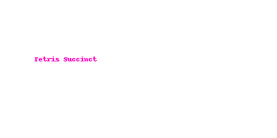

# Tetris Succinct zkProof 🎮🌸

Built with ❤️ using SP1 (https://github.com/user-attachments/assets/54b2fc92-9ed2-4486-8fbd-da85f7c7a764)

  

Bienvenido al primer Tetris Succinct zk-Verified del mundo.

🎮 Controls for Tetris Succinct zkProof:

⬅️ ← or A → Move Left
➡️ → or D → Move Right
⬇️ ↓ or S → Move Down (Soft Drop)
🔄 ↑ or W → Rotate Piece

